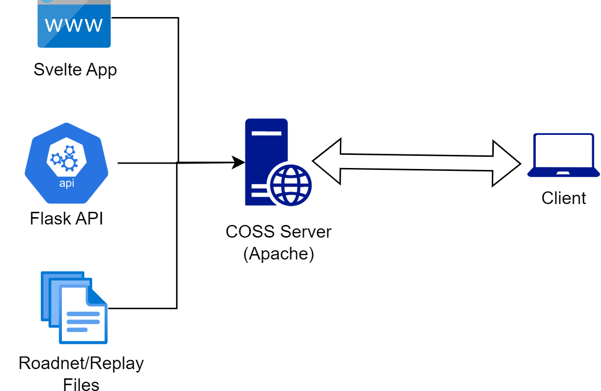

# Demonstrator for CoCi
As a part of the [CoCi project](https://coss.ethz.ch/research/CoCi.html), COSS ETHZ has built a software demonstrator to visualize various traffic control algorithms.
This repository contains the server and frontend code for the project. This file explains the high level design and setup instructions.

For information on extending and contributing to this project, read the [contribution guidelines](CONTRIBUTING.md).
## Design

The app consists of a Python/Flask backend (a simple REST API, located in `app.py`) and a Svelte frontend (locate under `svelte-app/`). Moreover, the simulation files generated using CityFlow are stored on the server under `${SERVER_HOME}/static/software_demonstrator_coci/`.



Below we explain the responsibilities of each of these components. A short technical presentation can be found [here](https://demonstrator.inn.ac/static/software-demonstrator.pdf)
### Simulation files
Each simulation is a parametrized by set of 3 files:
1. A roadnet (.json) definition of the network (aka Scenario)
2. A flow (.txt) definition of the traffic flows with 3600 timesteps (aka Method)
3. A density file which gives the density of vehicles on each road at each timestep
### Flask server
The flask server is responsible for serving the simulation files to the frontend. It also provides a REST API for the frontend to 
1. Fetch the list of available simulations. For each scenario, currently 5 possible methods are available.
2. Given the scenario/method combination, get the 3 files mentioned above corresponding to the combination.
### Svelte frontend
The frontend is responsible for rendering the simulation files. It extends the [CityFlow](https://cityflow.readthedocs.io/en/latest/) frontend with additional featrues such as:
1. Hosted predefined scenarios and a dropdown to select them
2. Support for multiple simulation runs to let user compare different methods side by side
3. A heatmap according to traffic density

We have used [Svelte](https://svelte.dev/) to modularize the design of frontend -- for example: (i) to encapsulate the simulation in a component, which allows us to spawn multiple of them for side-by-side comparison, (ii) to refactor Navbar, Controller etc into their own components so they can be reused or placed anywhere on the screen etc. We have also replaced gradually JavaScript with TypeScript for type-safety and better developer experience.

## Setting up for development
### Prelimnaries: preparing the simulation files
You can generate the roadnet/flow files yourself using the [CityFlow](https://cityflow.readthedocs.io/en/latest/) simulator. Alternatively, you can download the files for the scenarios we host from [here](https://demonstrator.inn.ac/static/software_demonstrator_coci/). The server expects all simulation files to be in present in the `static/software_demonstrator_coci/` directory, so create this directory and dump the files there. We have not checked-in any simulation files to github due to their large size.

### Running the development Flask server
1. Create a virtual environtment and activate it
```
python -m venv env
source env/bin/activate
```
2. Install the app
```
pip install -r requirements.txt
```
3. Run the app
```
env=development flask run
----
 * Debug mode: off
WARNING: This is a development server. Do not use it in a production deployment. Use a production WSGI server instead.
 * Running on http://127.0.0.1:5000
Press CTRL+C to quit

```
### Starting the Svelte app
You need `node` to run the development server. I recommend using Node Version Manager `nvm` to install/maintain node. The following commands have been tested with `node v18.12.1`. (To see the currently active version use `nvm current`)

Change to `svelte-app/` directory. Install dependencies with `npm install` and run
```bash
npm run dev
```
This setup assumes that the flask server is running on port `5000` on local as above. If this isn't the case, modify the variable `${SERVER_URL}` in [utils.ts](svelte-app/src/routes/demonstrator/utils.ts) to appropriate value.
## Deploying to production
Flask is not secure or performant enough to be used as a production server. Hence, we proxy the flask app by a [gunicorn](https://flask.palletsprojects.com/en/2.2.x/deploying/gunicorn/) server.

The [COSS server](https://serverinfo.inn.ac/) runs an Apache server to host all it's websites. Hence, we create an apache configuration for our app, and proxy API requests to the gunicorn instance
// TO-DO add step by step details of deploying to production (certificates, exact configuration files)

## Live
The app is currently deployed and can be viewed at https://demonstrator.inn.ac/
